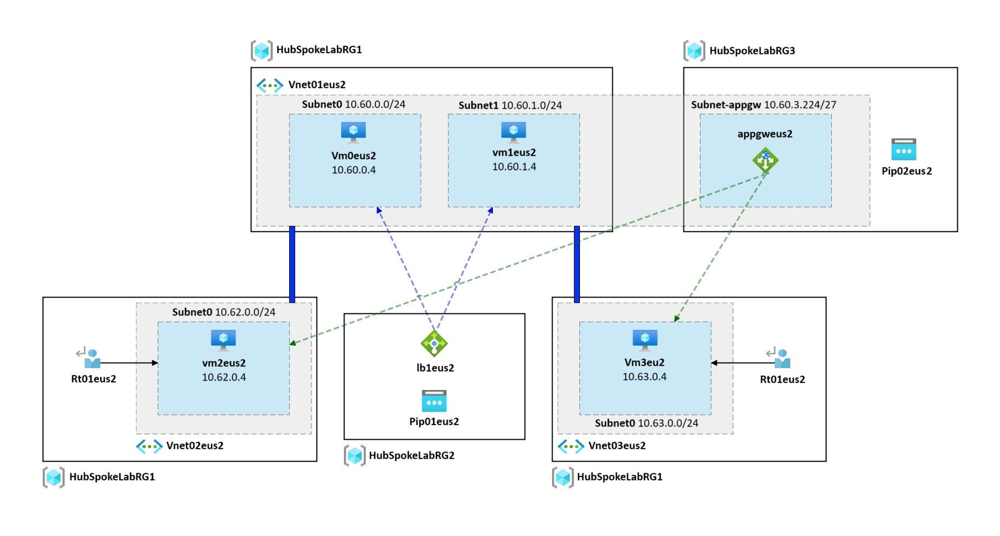

# Azure Traffic Management Lab

This is a deployable architecture through Bicep IAC of a hub and spoke network that usese a load balancer, an application gateway a route table and network peering to control the flow of traffic through out the hub and spoke architecture.

## How it works

#### Hub Network

In this architecture Vnet01eus2 serves as Hub in the network topology. Inside the hub sits 3 subnets, 2 containing 1 web server of the DS2 family 2019 Windows Datacenter in each, and the third containing an application gateway. Sitting in front of these 2 web servers sits an external facing OSI layer 4 load balancer with a public ip to evenly distribute traffic from the public internet between these 2 servers easily.

### Spoke 1 

Spoke 1 of the architecture is Vnet02eus2, which contains a single subnet that hosts another DS2 Windows 2019 Data Center vm used to host images. This virtual network is directly peered to Vnet01eus2 via local peering.

### Spoke 2

Spoke 2 of the network is Vnet02eus2, also containing a single subnet hosting a DS2 Windows 2019 Datacenter vm, this one used to host videos. This network, like spoke 1, is also directly paired to the hub network via local peering. 

### Connectivity between Spoke 1 and Spoke 2

Communications between spoke 1 and spoke 2 of the architecture are controlled through a route table and enabling IP forwarding through the Hub Virtual network.  Spoke 1 and spoke 2 both have a route table with user defined routes connecting one to the other through a virtual appliance next hop type.

### Application Gateway

The application gateway in the architecture sits in the hub virtual network with the vm's of spoke 1 and spoke 2 set as the backend pool. The job of this application gateway is to control and distrubte OSI layer 7 traffic between the videos and images servers. 